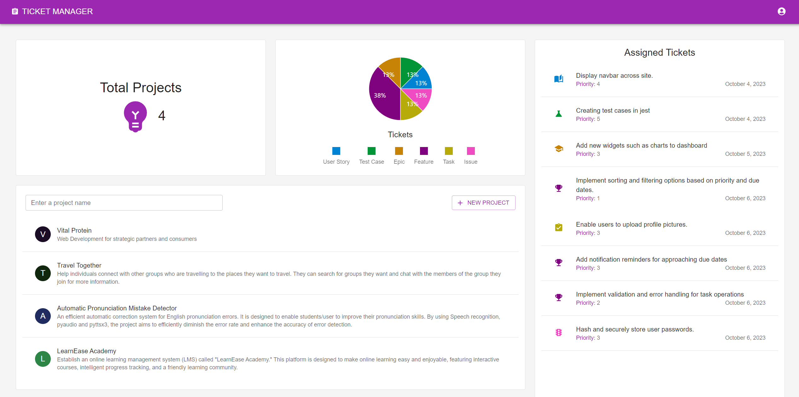
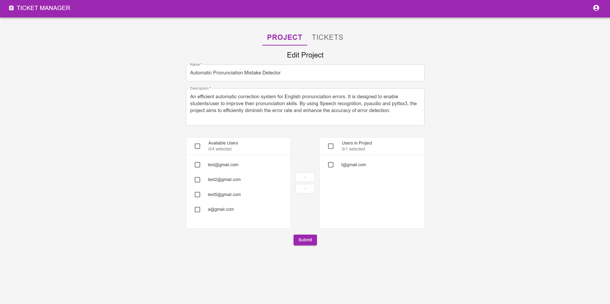
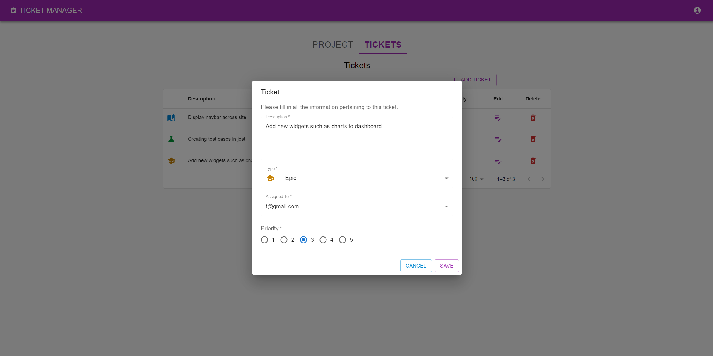

# Ticket Manager

Ticket Manager is a full-stack MERN (MongoDB, Express.js, React.js, Node.js) application that allows users to manage tickets, projects, and user accounts. This README file provides an overview of the application, its dependencies, environment variables, routes, and features.

## Table of Contents

-   [Dependencies](#dependencies)
-   [Demo](#demo)
-   [Environment Variables](#environment-variables)
-   [Installation](#installation)
-   [Usage](#usage)
-   [Routes](#routes)
-   [Features](#features)
-   [Client Frontend](#client-frontend)
-   [Contributing](#contributing)
-   [License](#license)

## Demo
Check out the live demo of this project [here](https://ticket-manager-solkyros.vercel.app/).

## Dependencies

The backend server of Ticket Manager relies on the following dependencies:

-   [bcrypt](https://www.npmjs.com/package/bcrypt): A library for hashing passwords, enhancing the security of user data.
    
-   [cookie-parser](https://www.npmjs.com/package/cookie-parser): Middleware for parsing cookies sent with HTTP requests.
    
-   [cors](https://www.npmjs.com/package/cors): Middleware that enables Cross-Origin Resource Sharing (CORS), allowing the frontend to make requests to the backend from different domains.
    
-   [dotenv](https://www.npmjs.com/package/dotenv): A module for loading environment variables from a `.env` file into `process.env`.
    
-   [express](https://expressjs.com/): A minimal and flexible Node.js web application framework that simplifies building robust APIs.
    
-   [express-async-handler](https://www.npmjs.com/package/express-async-handler): A utility for handling asynchronous errors in Express.js routes.
    
-   [jsonwebtoken](https://www.npmjs.com/package/jsonwebtoken): A library for generating JSON Web Tokens (JWTs), used for user authentication and authorization.
    
-   [mongoose](https://mongoosejs.com/): An ODM (Object Data Modeling) library for MongoDB, simplifying database interactions.
    

The frontend client of Ticket Manager uses the following dependencies:

-   [axios](https://www.npmjs.com/package/axios): A promise-based HTTP client for making AJAX requests to the backend API.
    
-   [react-hot-toast](https://www.npmjs.com/package/react-hot-toast): A library for displaying toast notifications in React applications.
    
-   [react-router-dom](https://www.npmjs.com/package/react-router-dom): A routing library for handling navigation within a React application.
    
-   [recharts](https://www.npmjs.com/package/recharts): A charting library for creating interactive and customizable charts and graphs.
    
-   [@mui/material](https://mui.com/): The Material-UI library provides a set of customizable React components implementing Google's Material Design.
    
-   [@mui/icons-material](https://mui.com/components/material-icons/): Material-UI icons that can be easily integrated into the application's UI components.
    

## Environment Variables

To run the application, you'll need to set up the following environment variables in a `.env` file in the **server** directory:

-   `PORT`: The port number where the server will run.
-   `CLIENT_URL`: The port where the client will run.
-   `CONNECTION_STRING`: MongoDB connection string.
-   `ACCESS_TOKEN_SECRET`: Secret key for generating JWT tokens.

Example `.env` file:

```env
PORT=5000
CLIENT_URL=http://localhost:3000
CONNECTION_STRING=mongodb://localhost/ticket-manager
ACCESS_TOKEN_SECRET=mysecretkey

```
To run the application, you'll need to set up the following environment variables in a `.env` file in the **client** directory:

-   `REACT_APP_API_URL`: The server URL to make api calls.
    
Example `.env` file:
```env
REACT_APP_API_URL=http://localhost:5000
```
*Make sure to replace the values with your specific configuration.*

## Installation

1.  Clone the repository:
    
    ```bash 
    git clone https://github.com/Solkyros/ticket-manager.git` 
    ```
2.  Navigate to the project directory:
	``` bash
	   cd ticket-manager
	   ```
3.  Install backend dependencies:
	```bash 
	cd server
	npm install
	```
4.  Navigate to the client directory:
     ```bash
    cd client
    npm install
    ```

## Usage

1.  Start the backend server in the **server** directory:
    ```bash
    npm start
	   ```
    The backend server will run on the port specified in the `.env` file.
    
2.  Start the frontend client in the **client** directory:
    
    bashCopy code
       ```bash
    npm start
	   ```
    The client will run on port 3000 by default.
    
3.  Access the application in your web browser by visiting `http://localhost:3000` (or the port you specified for the frontend).
    

## Routes

The Ticket Manager application has the following main routes on the backend:

-   `projectRoutes`: `/api/projects`
-   `ticketRoutes`: `/api/tickets`
-   `userRoutes`: `/api/users`

These routes handle project management, ticket management, and user management, respectively.

## Features

Ticket Manager offers the following features:

-   User authentication (login/signup).
-   Dashboard displaying:
    -   Total projects the user is part of.
    -   Tickets assigned to the user.
    -   Visualization of project data (charts).
-   Create and update projects.
-   Add users to projects.
-   Create, update, and delete tickets within projects.
-   Assign tickets to users within projects.

## Client Frontend

The client frontend is built using React.js and utilizes the Material-UI (`@mui`) package for UI components. The frontend provides a user-friendly interface for interacting with the Ticket Manager application.

Feel free to explore the codebase for more details and customization options.

**Note:** Ensure you have MongoDB running and configured properly for the application to work with the specified `CONNECTION_STRING`. Additionally, make sure the required environment variables are set before running the application.

## Screenshots

| Dashboard                           | Project                | Ticket |
| ----------------------------------- | --------------------------------- | --------------------------------- |
|  |  |  |
| Description: This screenshot shows the user's dashboard displaying project and ticket statistics. | Description: This screenshot shows the project management interface where users can create and manage projects. | Description: This screenshot displays the ticket management interface where users can create, update, and delete tickets. |

## Contributing

Contributions are welcome! If you have ideas for improvements or new features, follow these steps to contribute:

1.  Fork the repository on GitHub.
2.  Clone your forked repository to your local machine.
3.  Make your changes or add new features.
4.  Test your changes thoroughly.
5.  Create a pull request to merge your changes back into the original repository.


## License

This project is open-source and available under the [MIT License](https://en.wikipedia.org/wiki/MIT_License). You are free to use, modify, and distribute this project as you see fit.